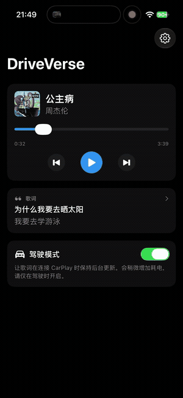

<p align="center">
  
</p>

<h1 align="center">DriveVerse</h1>

<p align="center"><a href="README.md">English</a> | 简体中文</p>

<p align="center"><strong>在 iPhone、iPad 和 CarPlay 屏幕上，实时显示与 Apple Music 播放进度同步的歌词。</strong></p>

<p align="center">
  
</p>

<p align="center"><em>歌词在锁屏上实时推进。iOS 26 会将同一实时活动镜像到 CarPlay。（<a href="assets/demo.mp4">观看视频</a>）</em></p>

DriveVerse 读取 Apple Music 正在播放的歌曲，查找同步歌词，并在 CarPlay、锁屏和灵动岛上显示当前歌词及下一句。它还提供播放/暂停、上一首/下一首和进度跳转等基本控制，音乐仍由 Apple Music 播放。

歌词始终保留原文；有翻译时会在下方显示。你也可以在设置中启用设备端音译，不会修改已存储的原文。

> **关于歌词与版权。** 应用通过第三方或社区接口，从酷狗音乐、网易云音乐和 [LRCLIB](https://lrclib.net) 搜索歌词，仅供自行构建和运行的个人应用使用。未经歌词提供方正式授权，请勿上架 App Store。歌词仅缓存在你的设备上，最长保留 30 天。

---

## 项目状态

开发与测试已于 **2026-10-02** 验收完成。已验收构建的信息见[结项记录](docs/DEVELOPMENT_HISTORY.md)。

## 功能

- 通过本地 MediaPlayer 框架，**读取 Apple Music 当前播放的歌曲**。
- 优先从酷狗和网易云获取 **KRC/YRC 逐字同步歌词**，最后使用 LRCLIB 兜底。
- 通过实时活动，**显示当前歌词及其翻译或下一句**；在 iOS 26 上，同一歌词卡片会出现在 **CarPlay、锁屏和灵动岛**。
- **保留歌词原文**，支持可选翻译、音译、简繁转换和时间偏移调整。
- 通过**驾驶模式**维持后台运行，避免手机放进口袋后 iOS 挂起应用，导致歌词停止更新。
- **沉浸式全屏歌词界面**：配色随专辑封面变化，支持点击歌词跳转、文字调整，以及手动滚动后恢复跟随；iPad 横屏提供独立的封面与控制栏。
- 应用内和锁屏实时活动支持**卡拉 OK 式逐字高亮**；应用内和展开的灵动岛提供播放控制。
- **可选锁屏歌词效果**：逐字歌词支持经典三色高亮或渐进填充，逐行歌词支持原始或粒子转场。渐进填充会为持续演唱的句末词添加轻微上浮和发光效果。
- **跟随系统语言**，支持简体中文、繁体中文，并以英语作为回退语言。

无需注册账号，无服务器、统计分析或跟踪。应用在你的手机上运行。

## 工作原理

```text
Apple Music ──(MediaPlayer，约 1 秒)──► 同步引擎 ─► 屏幕歌词
                                        │             │
                                        ▼             ▼
                                  按需多源查找     实时活动
                                  （缓存 30 天）   （CarPlay / 锁屏 / 灵动岛）
```

几个实现细节：

- **保持同步：** 在两次更新之间，应用会估算当前播放位置并找到对应歌词。切歌或跳转进度时，会检测变化并立即对齐到正确的歌词行。
- **按需匹配：** 按酷狗 → 网易云 → LRCLIB 的顺序查找，每个来源最多尝试三个候选结果。标题、歌手、专辑、时长、所需翻译/音译以及逐字时间均匹配后，停止继续查找。
- **CarPlay：** iOS 26 会自动将锁屏实时活动镜像到车载屏幕。项目没有 CarPlay entitlement，也没有 CPTemplate 代码；车载歌词通过实时活动呈现。

## 环境要求

- 运行 **iOS 26 或更高版本**的 iPhone 或 iPad。Apple Music 播放检测和实时活动需要真机，模拟器无法完整测试。
- 本地构建需要 **Xcode 27**。
- 用于签名并安装到手机的免费或付费 Apple Developer 账号。

## 安装与运行

### 1. 获取代码并打开项目

```bash
git clone https://github.com/M-E-L-S/LyricsIsland-driveverse.git
cd LyricsIsland-driveverse
```

`DriveVerse.xcodeproj` 由 `project.yml` 生成，因此未纳入版本控制。在 Mac 上，先安装 XcodeGen 并生成项目，再打开：

```bash
brew install xcodegen
./scripts/generate.sh
open DriveVerse.xcodeproj
```

如需直接下载安装包，可从 [Releases](https://github.com/M-E-L-S/LyricsIsland-driveverse/releases) 下载 `DriveVerse-unsigned.ipa`，用 AltStore 签名安装。初版版本号为 **v1.0.0**。

如果使用 Windows，可将源码推送到 GitHub。仓库自带的 GitHub Actions 工作流会使用 Xcode 27 运行单元测试、生成项目、构建包含实时活动扩展的未签名 iPhone/iPad 应用，并上传保留 14 天的 Actions 构建产物。推送 `v*` 版本标签后，构建成功的 IPA 还会自动发布到对应的 GitHub Release。

### 2. 签名并运行

在 Mac 本地构建时，用 Xcode 打开生成的项目，选择 **DriveVerse** scheme，并在 `DriveVerse` 和 `DriveVerseWidgets` 两个 target 的 **Signing & Capabilities** 页设置签名团队。连接 iPhone 或 iPad，点击 Run。

当前分支使用 `io.github.mels.driveverse`。如果签名时提示该标识符不可用于你的团队，请修改 `project.yml`，换成你可使用的标识符。实时活动扩展的标识符必须以主应用标识符为前缀：

```yaml
bundleIdPrefix: com.yourname                                 # options
PRODUCT_BUNDLE_IDENTIFIER: com.yourname.driveverse           # DriveVerse target
PRODUCT_BUNDLE_IDENTIFIER: com.yourname.driveverse.widgets   # DriveVerseWidgets target
```

修改后重新生成项目，或推送修改，由 GitHub Actions 生成。

### 3. 首次启动时的权限

- **媒体与 Apple Music**：用于读取 Apple Music 正在播放的内容。
- **实时活动**：在系统设置 → DriveVerse → 实时活动中开启**更频繁的更新**，否则进入后台约 30 秒后，歌词会停止更新。
- **定位（使用 App 期间）**：首次开启驾驶模式时申请，用于维持后台运行，原理见下文。如果需要免手动操作的 CarPlay 自动化，再允许后续申请的“始终”定位权限。

## 在车上使用

1. 将手机连接到 CarPlay，并在 Apple Music 中播放音乐。
2. 打开 DriveVerse，开启**驾驶模式**。
3. 播放有同步歌词的歌曲时，歌词卡片会出现在车载屏幕、锁屏和灵动岛上。

### 上车后自动开启

无需每次手动打开应用。DriveVerse 提供 **启动驾驶模式（Start Drive Mode）** 和 **停止驾驶模式（Stop Drive Mode）** 两个快捷指令操作：

1. 打开**快捷指令** → **自动化** → **+**。
2. 选择 **CarPlay** → **连接时** → **立即运行**，添加**启动驾驶模式**操作。
3. 再创建一个自动化：**CarPlay** → **断开连接时** → **立即运行** → **停止驾驶模式**。

连接 CarPlay 后，DriveVerse 会在后台启动并自动显示歌词卡片；播放音乐前会显示“♪ 等待音乐…”。断开 CarPlay 后，驾驶模式会关闭，不再持续后台运行。

### 为什么需要驾驶模式

锁屏或切换应用几秒后，iOS 会挂起应用，歌词也会随之停止更新。驾驶模式通过低功耗后台定位会话维持 DriveVerse 运行，只使用街区级粗略定位；位置信息收到后立即丢弃，不会保存或发送。

为什么使用定位，而不是播放静音音频？因为仅依靠后台音频保持运行时，iOS 会限制应用更新实时活动。后台定位与导航应用采用的方式相同，能够让歌词持续更新。它仍会消耗一些电量，因此驾驶模式需要手动开启；上述 CarPlay 自动化可在断开连接后立即关闭它。

## 隐私

应用在你的手机上运行，无后端、账号或统计分析。

- 在本地从 Apple Music 读取歌曲信息。
- 查找歌词时，仅向酷狗、网易云和 LRCLIB 发送基本歌曲信息：标题、歌手、专辑和时长。
- 歌词在设备上最多缓存 30 天，可通过设置 → 清除缓存删除。
- 驾驶模式获取的位置立即丢弃，不保存、不传输。
- 可选音译和简繁转换均在设备上完成，不会为此发送文本。

## 运行测试

项目包含完整的单元测试套件，使用 Swift Testing。GitHub Actions 会在打包 IPA 前运行测试。在 Xcode 中按 **Cmd-U**，或在 Mac 命令行执行：

```bash
./scripts/test.sh
```

测试覆盖 Apple Music 状态映射、KRC/YRC/LRC 解析、双语逐字时间、按需多源匹配、歌词来源回退、同步引擎、版本化缓存、歌词呈现和实时活动更新逻辑。

## 注意事项与限制

- 未开启驾驶模式时，应用进入后台不久后会停止更新；开启驾驶模式可维持更新。
- 实时活动支持按钮，不支持可拖动的进度条，因此其进度控制以 15 秒为单位前进或后退；应用内提供可拖动的进度条。
- 三个来源都没有可用匹配时，会显示“未找到歌词”。未命中的歌曲会在次日重新查找，已命中的结果会缓存。
- 酷狗和网易云使用非官方接口，可能发生变化或存在地区限制；请求失败的来源会自动跳过。
- 可选音译使用系统标准转换，通常易读，但有时会偏向字面转换。
- 没有独立的 CarPlay 仪表盘小组件，车载歌词通过实时活动呈现。

## 项目结构

```text
DriveVerse/
├── App/            应用入口、驾驶模式快捷指令和主要模块组装
├── Core/
│   ├── NowPlaying/ Apple Music 播放状态监听
│   ├── Lyrics/     歌词来源、按需匹配、KRC/YRC/LRC 解析、缓存与呈现
│   ├── Sync/       歌词与播放进度同步
│   └── KeepAlive/  驾驶模式后台定位会话
├── LiveActivity/   CarPlay / 锁屏歌词卡片
├── Features/       首页、全屏歌词、设置（SwiftUI）
└── Resources/      资源与 Info.plist
DriveVerseWidgets/  实时活动与灵动岛界面
DriveVerseTests/    测试套件
```

Xcode 项目通过 [XcodeGen](https://github.com/yonaskolb/XcodeGen) 从 `project.yml` 生成。`Package.swift` 用于在 Mac 上无需设备即可测试核心逻辑。

## 技术栈

Swift、SwiftUI、ActivityKit、WidgetKit、MediaPlayer、Core Location 和 Compression，无第三方运行时库。歌词来自酷狗音乐、网易云音乐和 [LRCLIB](https://lrclib.net)。

## 许可证

应用代码采用 [MIT 许可证](LICENSE)。YRC/KRC 相关实现的 Apache-2.0 署名说明见 [THIRD_PARTY_NOTICES.md](THIRD_PARTY_NOTICES.md)。这些许可证不涵盖获取的歌词，歌词版权归各自权利人所有。
